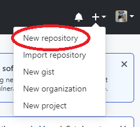
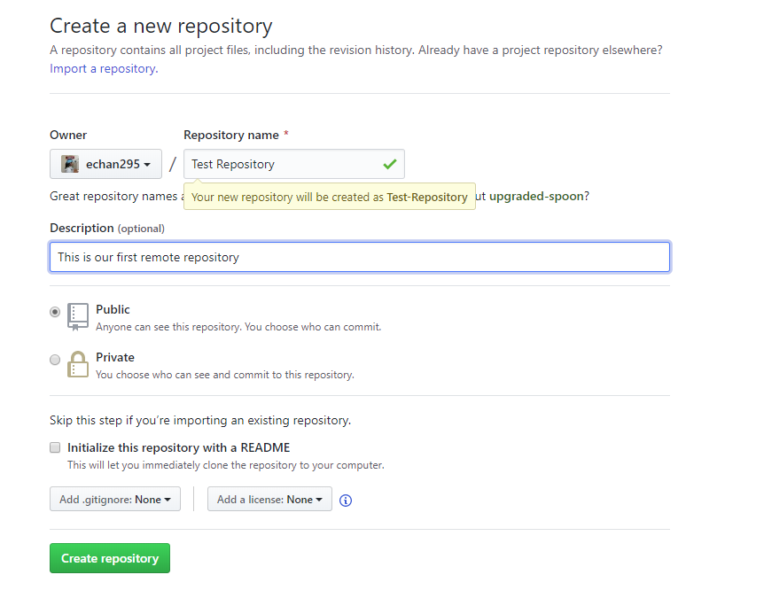
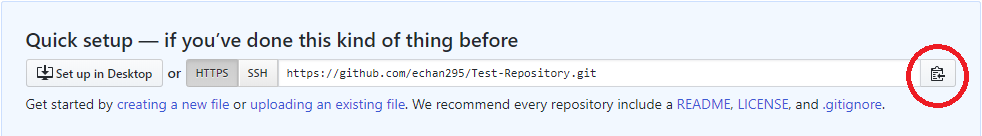
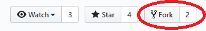
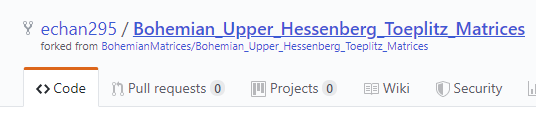

# Quick Introduction to Git/GitHub

This documentation will give you a brief introduction to Git and GitHub.

Git is a "version-control system for tracking changes in source code during software development. It is designed for coordinating work among programmers, but it can be used to track changes in any set of files". Git is local to your computer.

GitHub is a "Git repository hosting service" with added features. GitHub stores your repository on "the cloud" rather than on your computer.

## Introduction to Git
Git comes pre-installed in most computers. However, if Git is not installed onto your computer, you can install it [here](https://git-scm.com/downloads). While installing Git from this website also gives you a nice graphical user interface, this tutorial will only use terminal to access Git.

After you have installed Git, you need to set up your Git environment. You only need to do this the first time you install Git on your computer.
```console
git config --global user.name "Your Name"
git config --global user.email "youremail@email.com"
```
By including `--global`, all repositories that you make on your computer will be under the name and email that you have provided. If, for example, you want one repository to be under different credentials, then after you have create your repository (which will be shown next), you can type
```console
git config --local user.name "Different Name"
git config --local user.email "differenemail@email.com"
```

Now that we have provided our name and email, we want to create a local repository on your computer. As a reminder, to navigate around your computer, the following provides some common and useful bash commands:
```console
pwd # gives working directory
ls # lists contents in directory
cd <directoryname> # change directory
cd .. # change one directory up
mkdir <directoryname> # make directory
touch <filename.extension> # create file without any content
```

### Basic Git Commands
Navigate your way to the directory you would like to make your repository, and initialize git by typing
```console
git init
```
in your terminal. A hidden folder called `.git` will be made in the directory. Congratulations, you have started your first repository!

Since your folder is probably empty, it is not that interesting to use Git. Let us create a file from the terminal by typing
```console
touch hello.cpp
```
This creates a file called `hello.cpp` in the working directory. Open this file using your favourite text editor and copy and paste the following.
```c++
#include <iostream>

int main(int argc, char const *argv[]) {
  std::cout << "Hello World\n";
  return 0;
}
```
Now, we want to "save" this file to Git. Rather than using the term "save", we will use the preferred terminology "commit". Before committing your file, we first need to *add* your file to the so-called *staging area*. It indicates to Git that you want to include the updates to the particular file in the next commit. There are many options to add your files to Git:
```console
git add .
```
means to stage all changes for the next commit,
```console
git add *.ext
```
means to stage all changes in all files with that particular extension for the next commit,
```console
git add <file>
```
to stage all changes in <file> for the next commit, and lastly,
```console
git add <directory>
```
to stage all changes in <directory> for the next commit. If you want to add a lot of files but want to ignore a few, you can create a file called `.gitignore` and include those particular files that you do not want to add. Similar to `git add`, you are able to filter files by extensions, by the file name, or by directory.

After we have stages our changes, we can use the command
```console
git status
```
to take a look at the state of the working directory and the staging area. It lets you see which changes have been stages, which haven't, and which files aren't being tracked by Git. This command is extremely handy when staging for your next commit.

Once you have successfully added all the files that you desire to the staging area, we are ready to commit the files. To commit, the preferred command is
```console
git commit -m "Enter changes here"
```
If we had just typed `git commit`, Git will take you to a text editor on your terminal, such as Nano or Vim, for you to write a commit message. Not only does this take more time, if you are unfamiliar with these particular programs, you may not be able to commit anything to Git. (If by chance you accidentally typed `git commit`, to exit Vim, type `:wq`, to exit Nano, type `Ctrl+x`).

Congratulations, you have successfully performed your first commit!

To view your commit history, we use the command
```console
git log
```
To exit from this, type `q`. You can also view a condensed version of this by adding a parameter. The command to see a condensed version of your commit history is
```console
git log --oneline
```

### Branching and Merging
Branching means that you diverge from the main line of development and continue to do work without messing with that main line. Typically, we use branches when we want to add new features or fix a bug in our program. The following image visualizes a repository with two isolated lines of development: one for a little feature, and one for a longer funning feature. By developing them in branches, it is not only possible to work on both of them in parallel, but it also keeps the main master branch free from questionable code.

<p align="center">
  
</p>

Let's say that we want to add a new feature to our `hello.cpp` program. To build a new branch, use the command
```console
git branch newfeature
```
Git then builds a new branch called `newfeature`. To list all the branches in your repository, we can type the command
```console
git branch
```
This command is synonymous with `git branch --list`. Not only does this command lists all the branches, it also tells you which branch you are on (indicated by the `*` before the branch name). To switch branches, you type
```console
git checkout newfeature
```
since we want to switch to the `newfeature` branch. Now, we can start working on our new feature: a function! Open the file `hello.cpp` that we made earlier and copy and paste the following function:
```c++
void printString(std::string s)
{
  std::cout << s << "\n";
}
```
After we checked that our program is working without bugs, we can commit the file containing our new feature:
```console
git add .
git commit -m "added printString function"
```

*Aside: If we switched back to the `master` branch, you will find that the `hello.cpp` file no longer contains the changes that were made in the `newfeature` branch.*

Let's say that we are supposedly happy with this new feature. We then want to merge the changes done in your `newfeature` branch to the `master` branch so that everyone has access to the new changes. To merge your changes, we first need to switch back to the `master` branch:
```console
git checkout master
```
then we are ready to merge. (Note: you must commit all changes in your `newfeature` branch in order to be able to merge the changes.) The command to merge the changes to your `master` branch is
```console
git merge newfeature
```
Since we are on the `master` branch, this command indicates that we want to merge the changes done in the `newfeature` branch to the `master` branch. Now that the changes have been merged, the `newfeature` branch can be deleted using the command
```console
git branch -d newfeature
```
The `-d` indicates that the `newfeature` branch will be deleted.

## Introduction to GitHub
Now that we know the basics of Git, we can begin our discussion on GitHub. As a reminder, Git and GitHub are two separate entities: Git is local to your computer, GitHub is remote. In this discussion, we will learn how to "sync" your local and remote repositories, "fork" a repository (and keep this repository in sync).

### Setting up your first repository on GitHub
We first need to sign in to GitHub and create a new repository. As shown in the image below, the button to create a new repository is located on the top right of your screen under the `+` drop down menu.



Clicking "New repository" will then take you to a page that looks like the image below. Name your repository, and give your repository a description if you'd like, and then click "Create repository".



GitHub will then make the repository and bring you to the link where your repository is located. Since this is a new repository, GitHub gives you some commands to get started. We will highlight them here (if we haven't already). In the blue box, like the one that is shown in the image below, there is a link to your remote repository. Click on the button (circled in the image below) to copy the link---you will need it shortly.



### Pushing your local repository (Git) to a remote repository (GitHub)
Now, in your terminal (in the same directory where you have stored your git repository), type in the following command:
```console
git remote add origin <paste link here>
```
(Note: do not include the angled brackets.) This tells Git the location of your remote repository. Now, you are able to "push" your committed files from your local repository (`master` branch) to your remote one (called `origin`) by typing
```console
git push origin master
```
Terminal will prompt you to enter your GitHub username and password (so don't forget them!). Refresh your GitHub repository, and you will see that the files from your local repository are also on GitHub.

### Forking a repository
Let's say that there is a repository that you don't own that you'd like to contribute to. GitHub (not Git) has a feature called "forking". By forking a repository, essentially you are making a copy of the original repository, in which you own the duplicate. This allows you to change the code without disturbing the original code. To fork a repository, all you need to do is click the "fork" button, like the one in the image below.



After clicking this button, GitHub creates a duplicate of the repository and takes you to where the duplicate is stored. Notice the title of the repository: see image below for an example.


